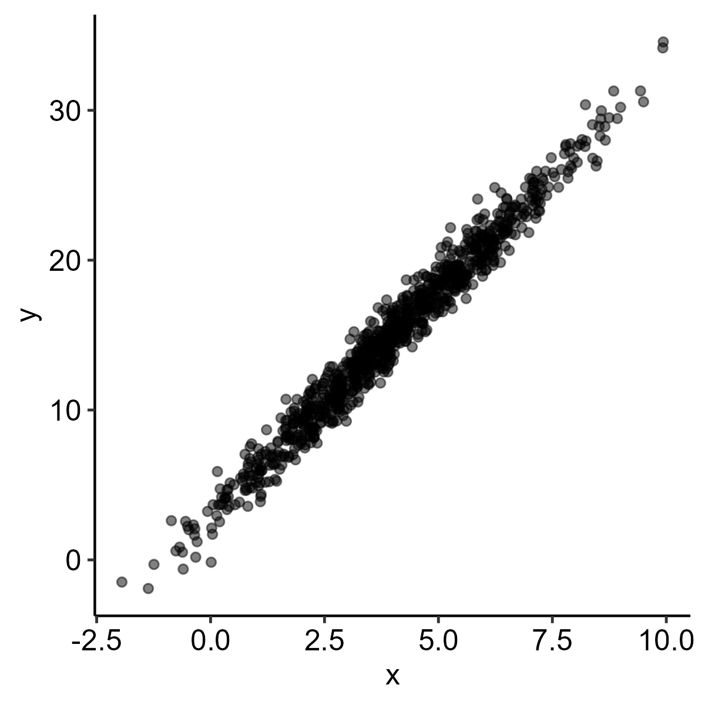
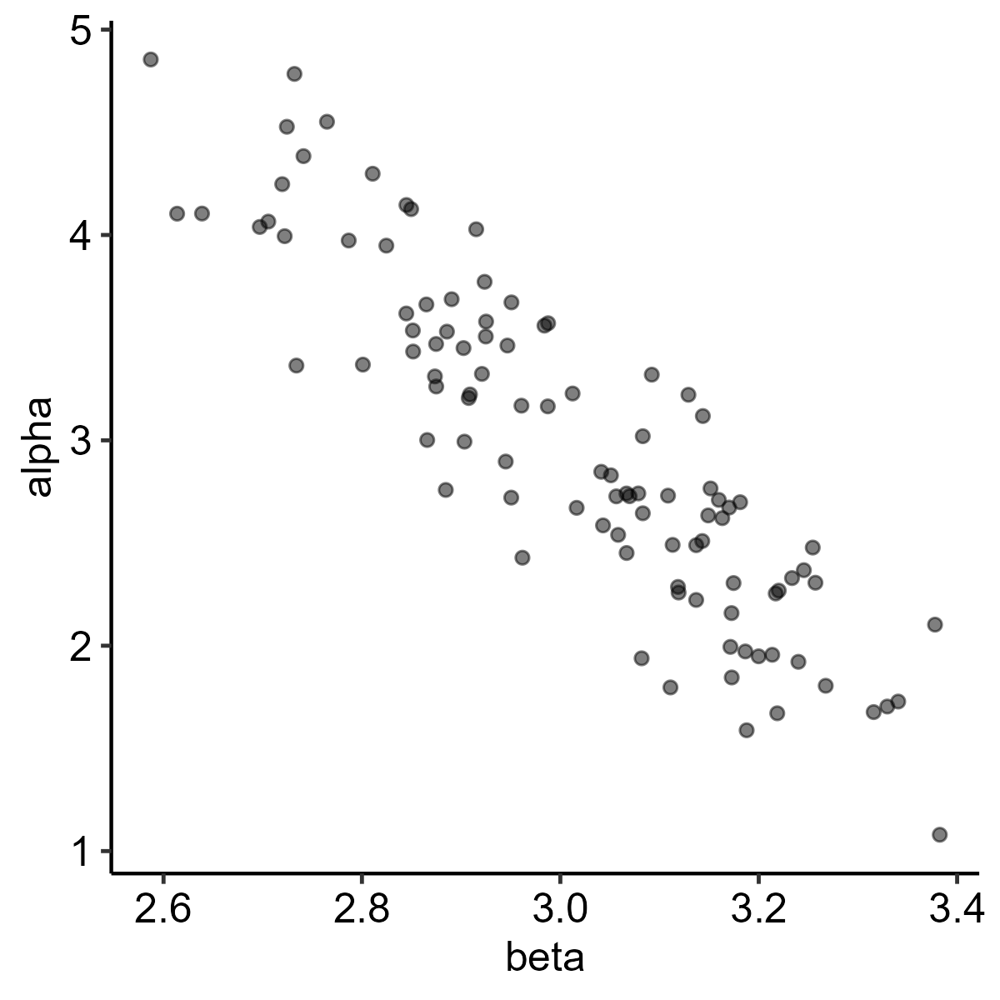
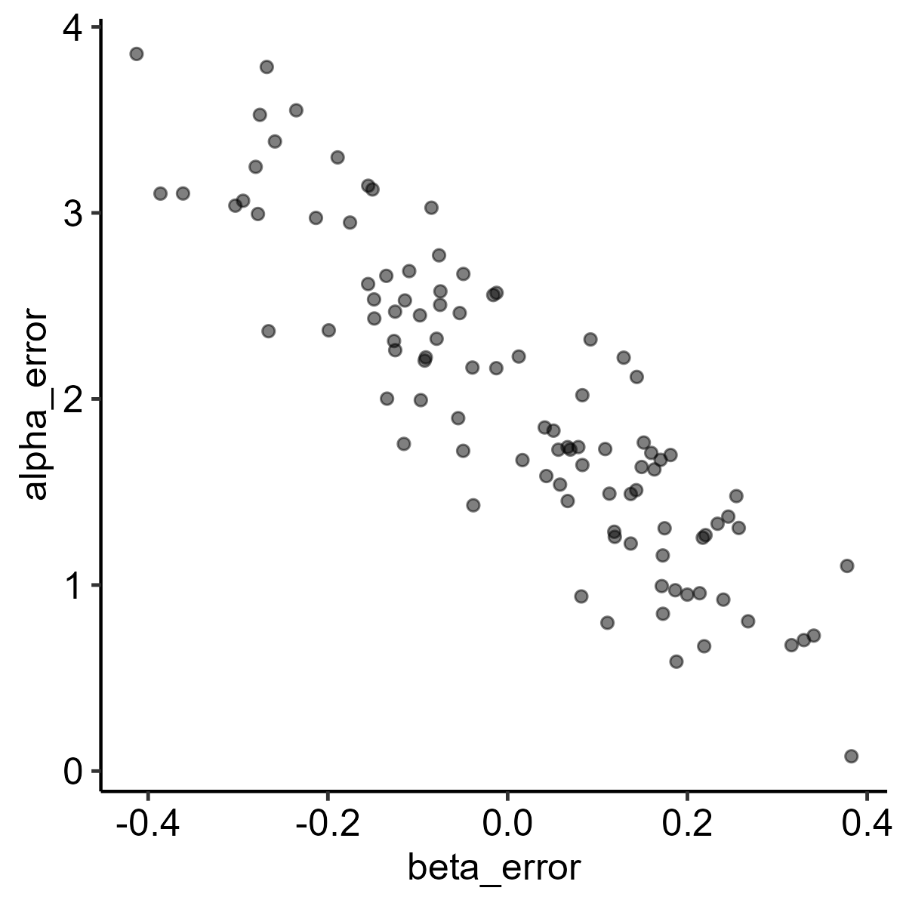

# Estimator Covariance


**Find covariance of errors in coefficient estimates for simulated
disjoint samples.**

Let’s set up some parameters and a seed.

``` r
set.seed(7)

n_population = 1000
n_samples = 100

mean_population = 4
sd_population = 2

mean_noise = 2
sd_noise = 1

alpha_population = 1
beta_population = 3
```

Now, let’s simulate a data-generating process on those parameters, pick
disjoint samples, and run a simple linear regression on each sample. I
set up the samples to be disjoint because that was easier than sampling
with or without replacement, but it’s possible that affects results in a
way I haven’t thought of.

x follows the normal distribution about “mean_population” with dispersal
“sd_population.”

y is equal to 1 + 3x, plus noise following the normal distribution about
“mean_noise” with dispersal “sd_noise.”

``` r
# Simulate a data-generating process.
dat = 
  tibble(group = rep(1:n_samples, each = n_population / n_samples),
         x = rnorm(n_population, mean_population, sd_population),
         y = (alpha_population + beta_population * x) + rnorm(n_population, mean_noise, sd_noise)) %>% 
  # Prepare samples for regression.
  group_by(group) %>% 
  nest %>% 
  # Regress.
  mutate(model = 
           map(data,
               ~ lm(y ~ x, .x)),
         # Get coefficients.
         coefficients = 
           map(model,
               coef),
         alpha = 
           map(coefficients,
               extract2,
               1),
         beta = 
           map(coefficients,
               extract2,
               2),
         # Get error for each coefficient from the original parameter.
         alpha_error = 
           map(alpha,
               ~ subtract(.x, alpha_population)),
         beta_error = 
           map(beta,
               ~ subtract(.x, beta_population)))

# Check the resulting object.
dat %>% head(5)
```

    # A tibble: 5 × 8
    # Groups:   group [5]
      group data              model  coefficients alpha beta  alpha_error beta_error
      <int> <list>            <list> <list>       <lis> <lis> <list>      <list>    
    1     1 <tibble [10 × 2]> <lm>   <dbl [2]>    <dbl> <dbl> <dbl [1]>   <dbl [1]> 
    2     2 <tibble [10 × 2]> <lm>   <dbl [2]>    <dbl> <dbl> <dbl [1]>   <dbl [1]> 
    3     3 <tibble [10 × 2]> <lm>   <dbl [2]>    <dbl> <dbl> <dbl [1]>   <dbl [1]> 
    4     4 <tibble [10 × 2]> <lm>   <dbl [2]>    <dbl> <dbl> <dbl [1]>   <dbl [1]> 
    5     5 <tibble [10 × 2]> <lm>   <dbl [2]>    <dbl> <dbl> <dbl [1]>   <dbl [1]> 

So, we have 100 samples of 10 observations and a simple linear
regression model for each.

That suggests a few visualizations to check distributions and, finally,
the covariance of interest.

``` r
vis_population = 
  dat %>% 
  ungroup %>% 
  select(data) %>% 
  unnest %>% 
  ggplot() +
  geom_point(aes(x = x,
                 y = y),
             alpha = 0.50) +
  theme_pubr()

ggsave("output/vis_population.png",
       vis_population,
       width = 4,
       height = 4,
       dpi = 300)
```



The population looks about right. The x-values and y-values less than
zero aren’t a substantial issue.

``` r
vis_coef = 
  dat %>% 
  ungroup %>% 
  select(alpha, beta) %>% 
  unnest %>% 
  ggplot() +
  geom_point(aes(x = beta,
                 y = alpha),
             alpha = 0.50) +
  theme_pubr()

ggsave("output/vis_coef.png",
       vis_coef,
       width = 4,
       height = 4,
       dpi = 300)
```



The sample estimates of alpha vary with the sample estimates of beta,
which really is the whole result.

But let’s go on to show the same thing is true of the error in
estimates.

``` r
vis_error = 
  dat %>% 
  ungroup %>% 
  select(alpha_error, beta_error) %>% 
  unnest %>% 
  ggplot() + 
  geom_point(aes(x = beta_error,
                 y = alpha_error),
             alpha = 0.50) +
  theme_pubr()

ggsave("output/vis_error.png",
       vis_error,
       width = 4,
       height = 4,
       dpi = 300)
```



This turn out to be the same distribution as above, which I didn’t
realize before running it. Neat.

Let’s finally look at covariance.

``` r
dat_cov_error = 
  dat %>% 
  ungroup %>% 
  select(alpha_error, beta_error) %>% 
  unnest

val_cov_error = cov(dat_cov_error$alpha_error, dat_cov_error$beta_error)

val_cov_error
```

    [1] -0.1350752

``` r
val_cov_error == 0
```

    [1] FALSE

Turns out that, for this simulation, error in one estimated coefficient
varies with that of another.

This does not, however, suggest a method for proving that from the
formula for coefficient variance.
